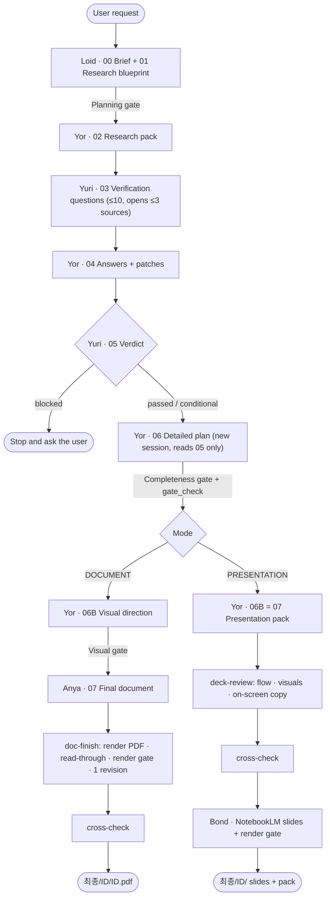
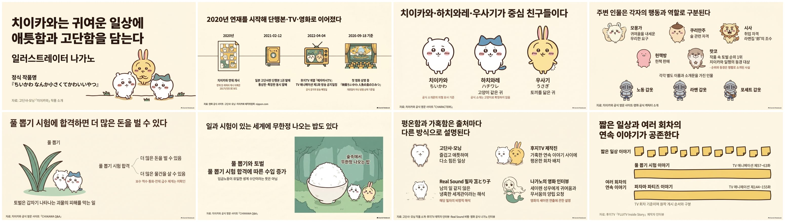

# DocuMaster

**A multi-agent orchestration for research-backed documents and presentation decks — built so that no sentence ships without evidence.**

You ask for a report or a deck in plain language. DocuMaster plans the research, has one model gather facts, has a model from a *different vendor* verify them, designs the structure from verified facts only, and then writes and renders the result.

> **Accuracy > source reliability > logical completeness > output quality > token efficiency > speed**

---

## Output

| Mode | When | Output | Quality target |
| --- | --- | --- | --- |
| **DOCUMENT** | Reports, analyses, proposals, submissions | `최종/<ID>/<ID>.pdf` | **Final, ready to submit.** No quality step is skipped |
| **PRESENTATION** | Decks, talks, slides | `최종/<ID>/` slide PDF + presentation pack | **A strong first draft.** Final design is done separately |

---

## The team

The agents are named after the *Spy×Family* cast. Each one does a single job and nothing else.

| Name | What it is | Responsibility | Never does |
| --- | --- | --- | --- |
| **Loid** (로이드) | The Claude Code session | Mode decision, brief & research plan, adoption decisions, every gate, final cross-check | Invent facts, redesign the plan |
| **Yor** (요르) | Codex `gpt-5.6-sol` · xhigh | **The only source of facts** (research, verification answers), detailed plan, visual plan / presentation pack | Approve its own research, add facts after verification |
| **Yuri** (유리) | Claude `sonnet` sub-agent | Independent verification — questions the research, opens sources itself, issues the verdict | Planning, large-scale research, writing |
| **Anya** (아냐) | Claude `opus` sub-agent | **DOCUMENT only** — writes and revises the final document from the verified plan | New research, unverified facts, structural changes |
| **Bond** (본드) | NotebookLM via the `nlm` CLI | Turns the presentation pack into slides | Add anything outside the pack |

Yor and Yuri come from different vendors, so we *assume* they are less likely to make the same mistake. This has not been measured.

---

## Pipeline



### Design rules that hold it together

- **Verification happens once.** Yuri asks at most ten questions, targeting the riskiest claims first, and opens up to three sources herself. Anything left unresolved is closed as **REMOVE**, closed as **CAUTION**, or reported to the user.
- **`05` is the single source of truth for facts, and `06` is the single source of truth for structure.** From `06` onward nobody reads the raw research, and nobody adds a fact.
- **Content and visuals are separate calls.** When `06` named formats such as tables or cards, the decks came out as walls of cards. So `06` decides *what* is said, and `06B` decides *how it looks*.
- **LOCKED vs FLEX.** Facts, numbers, structure, CAUTION placement and claim strength are LOCKED. Only phrasing marked `(FLEX)` is up to the writer. Claim strength may only ever be lowered.
- **A conclusion is never stronger than its evidence.** Turning a before/after comparison into a cause, or a recommendation into a proven result, is an error even when every number is right.
- **`[Unverified]` is a normal output.** A search snippet is not a verified source. Nobody fakes a URL, a paper, a statistic or a NotebookLM run.

### Verdicts

| Verdict | First line of `05` | What happens next |
| --- | --- | --- |
| `passed` | `검증 통과 — 이상 없음` | Continue |
| `conditional` | `검증 통과 — 조건부` | Apply REMOVE and CAUTION, then continue |
| `blocked` | `검증 보류 — 확인 불가` | Stop and ask the user |

Each claim gets one of four labels: **APPROVED**, **CORRECTED**, **REMOVE** (never written) or **CAUTION** (written with its limitation sentence right next to it).

### Mechanical gate: `gate_check.py`

```bash
python .claude/tools/gate_check.py <ID> 06|06b|07
```

This script runs before Loid reads a gated file. It catches:

- numbers that do not appear in `05`
- a REMOVE item's evidence ID showing up again
- a CAUTION sentence that is not copied verbatim
- a LOCKED violation: chapters or sections, or slide count and order, that differ from `06`
- Character Model drift between slides
- source captions on slides that should not have one
- a title repeated as on-screen copy

It exits with `FAIL` (send back to the owner) or `CHECK` (a human closes it and logs why). It does **not** catch a REMOVE claim reworded to look new, or claim-strength inflation. Those are still read by a person.

---

## Repository layout

```
CLAUDE.md                 Constitution & wiring (loaded every turn — kept under 10 KB)
.claude/
├─ 공통/                   Shared standards: evidence policy · document spec · presentation spec
├─ 요르/ 유리/ 아냐/ 로이드/   Role + procedure files, one folder per agent
├─ skills/                doc-finish · cross-check · deck-review · notebooklm-handoff
├─ tools/                 gate_check · md2html · make_pdf · apply_patch · nlm_pipeline
├─ 환경기록.md             One-line index of environment findings (E-numbers)
└─ archive/               Retired originals (local only, not read)
자료/                      User reference material (not committed)
작업/<ID>/                 Work in progress: 상태.md (resume point) · 기록.md (decision log) · workspace/00–07
                          (the repo keeps only the latest version of each workspace file)
최종/<ID>/                 Outputs that passed every gate — listed in 최종/_manifest.md
```

Each rule lives in exactly one file. Size budgets keep the rules short: `CLAUDE.md` 10 KB, procedure and skill files 6 KB each.

---

## Usage

Open this folder in Claude Code and describe what you need:

```
2026년 국내 전기차 충전 인프라 정책 보고서를 써줘. A4 10쪽, 정책 담당자용.
치이카와 세계관 소개 발표자료 만들어줘. 11장.
```

(The two examples ask for a 10-page A4 policy report on Korea's EV charging infrastructure for policy staff, and an 11-slide deck introducing the world of Chiikawa.)

Loid picks the mode and runs the pipeline. It stops to ask only when:

- the mode is ambiguous,
- the evidence forces a change of direction, or
- verification is blocked.

**Requirements:** Claude Code, Codex CLI (`codex.cmd`), Python 3.12 with PyMuPDF and Pillow, Microsoft Edge for HTML→PDF, the Pretendard font, and `nlm` (notebooklm-mcp-cli) with a one-time `nlm login`.

---

## Work so far

### Delivered

Every run keeps its full paper trail in `작업/<ID>/workspace/`: brief → blueprint → research → verification questions → answers → verdict → plan → pack. You can follow each fact from the source it came from to the slide it lands on.

#### 치이카와 세계관 — *The World of Chiikawa* · PRESENTATION · 2026-09-18

The deck introduces Chiikawa's world: under the cute characters sit hard, almost harsh rules about work, exams and monsters.

- **Process:** 8 research questions → verdict *conditional* (APPROVED 7 · CORRECTED 1 · REMOVE 3 · CAUTION 6). 11 slides, 18 evidence items, rendered by NotebookLM.
- **Iterations:** three presentation-pack versions (VER3). This run produced the rules for character consistency, breath-unit line breaks and "no text-only decks".



[Slides (PDF)](최종/치이카와세계관_20260918/치이카와세계관_20260918_슬라이드.pdf) · [Verdict (05)](작업/치이카와세계관_20260918/workspace/05_verified_research_pack.md) · [Presentation pack](작업/치이카와세계관_20260918/workspace/07_notebooklm_presentation_pack_v03.md)

### Orchestration history

| Date | Milestone |
| --- | --- |
| 2026-09-17 | Pipeline smoke test — first end-to-end NotebookLM run: upload → generate → download → mechanical checks |
| 2026-09-18 | Architecture review and refactoring. Split planning (06) from writing (07) and added the LOCKED/FLEX boundary |
| 2026-09-18 | Production run (Chiikawa). Added the claim-strength check (E-021), separated content from visuals (E-026), and made the Character Model repeat verbatim on every slide (E-031, E-036) |
| 2026-09-19 | Team reshuffle (E-039): Codex became the sole fact supplier and Claude sonnet the independent verifier; `06` now starts a fresh session instead of resuming research |
| 2026-09-19 | Compression (E-040): size budgets, per-mode specs, the `doc-finish` skill, and a render gate that shows one contact sheet first and zooms in only on suspect pages |
| 2026-09-19 | `gate_check.py` (E-041) automates the fact-leak and LOCKED checks. `apply_patch.py` now also extracts `04` (fixes a missing-env-var bug). The repository moved to git |

### Not yet verified

- The full DOCUMENT path (`06B` → Anya → `doc-finish`) has not run on a real job, and page breaks past 10 pages are untested.
- Whether NotebookLM follows the new pack format (one line per item, "no title" slides).
- How often Yor and Yuri make the *same* mistake, and whether ten questions are enough.

---

<sub>Rules are written in Korean. Outputs in `최종/` are drafts built from publicly available sources for personal study. Character names and images belong to their rights holders.</sub>
